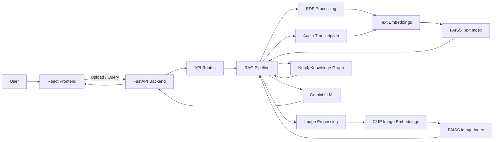

# Multimodal Legal RAG Assistant

An AI-powered legal and policy document assistant that allows users to upload documents and ask questions using Retrieval-Augmented Generation, multimodal embeddings, and a Neo4j knowledge graph.

## Overview

This project is a full-stack AI application for understanding legal and policy-related content. Users can upload PDFs, images, and audio files, then ask questions through a chat interface. The backend retrieves relevant information from uploaded content and a knowledge graph, then uses a Large Language Model to generate a grounded explanation.

In simple terms, the system works like this:

1. Upload a legal or policy document.
2. The backend extracts and processes the content.
3. Text, image, and audio data are converted into embeddings.
4. FAISS performs similarity search over the stored embeddings.
5. Neo4j provides structured legal knowledge through graph search.
6. Gemini generates a final explanation using the retrieved context.

## Features

- PDF upload and document text extraction
- PDF summarization using Gemini
- Text chunking and semantic search
- Image upload and CLIP-based image retrieval
- Audio upload and Whisper-based transcription
- FAISS vector search for text and image embeddings
- Neo4j knowledge graph integration
- React-based chat interface
- FastAPI backend
- Docker Compose setup for frontend, backend, and Neo4j

## Tech Stack

### Frontend

- React
- Vite
- Axios

### Backend

- FastAPI
- Uvicorn
- LangChain
- SentenceTransformers
- FAISS
- OpenAI CLIP
- OpenAI Whisper
- Google Generative AI / Gemini
- Neo4j

### DevOps

- Docker
- Docker Compose

## Project Structure

```text
TS/
  frontend/
    src/
      App.jsx
      main.jsx
    package.json
    vite.config.js
    Dockerfile

  backend/
    app/
      main.py
      routes.py
      rag.py
      embeddings.py
      graph.py
      llm.py
    Dockerfile

  docker-compose.yml
  requirements.txt
  .env.example
  .gitignore
```

## How It Works

### PDF Pipeline

When a PDF is uploaded:

- The backend receives the file through `/upload/pdf`.
- `PyPDFLoader` extracts page text.
- Gemini generates a short document summary.
- The text is split into chunks using `RecursiveCharacterTextSplitter`.
- Each chunk is embedded using `all-MiniLM-L6-v2`.
- Embeddings are stored in a FAISS text index.

### Image Pipeline

When an image is uploaded:

- The backend receives the file through `/upload/image`.
- The image is processed with PIL.
- CLIP `ViT-B/32` creates an image embedding.
- The embedding is stored in a FAISS image index.
- User text queries are embedded using CLIP text encoding for image retrieval.

### Audio Pipeline

When an audio file is uploaded:

- The backend receives the file through `/upload/audio`.
- Whisper transcribes the audio into text.
- The transcript is embedded using the text embedding model.
- The transcript is stored in the FAISS text index.

### Query Pipeline

When a user asks a question:

- The frontend sends the question to `/query`.
- The backend searches the FAISS text index.
- The backend searches the FAISS image index.
- The backend searches Neo4j for matching graph entities.
- Retrieved context is passed to Gemini.
- Gemini generates a concise explanation.
- The frontend displays the answer, explanation, and retrieved context.

## API Endpoints

| Method | Endpoint | Description |
|---|---|---|
| `POST` | `/upload/pdf` | Upload and process a PDF document |
| `POST` | `/upload/image` | Upload and process an image |
| `POST` | `/upload/audio` | Upload and process an audio file |
| `POST` | `/query` | Ask a question about uploaded content |

## Environment Variables

Create a `.env` file from `.env.example`:

```bash
cp .env.example .env
```

Required/optional variables:

```env
GEMINI_API_KEY=your_gemini_api_key
GEMINI_MODEL=gemini-3-flash
LLM_MAX_CONTEXT_CHARS=6000
CORS_ALLOW_ORIGINS=http://localhost:3000,http://127.0.0.1:3000
```

Do not commit `.env` to GitHub. Keep secrets only in your local environment.

## Running With Docker

From the project root:

```bash
docker compose up --build
```

Then open:

- Frontend: `http://localhost:3000`
- Backend API docs: `http://localhost:8000/docs`
- Neo4j Browser: `http://localhost:7474`

Neo4j credentials from the Docker Compose file:

```text
Username: neo4j
Password: password
```

## Running Locally

### Backend

```bash
cd TS
python -m venv .venv
.venv\Scripts\activate
pip install -r requirements.txt
cd backend
uvicorn app.main:app --reload --host 0.0.0.0 --port 8000
```

### Frontend

Open another terminal:

```bash
cd TS/frontend
npm install
npm run dev
```

Frontend will run at:

```text
http://localhost:3000
```

## Architecture



## Main Files

| File | Purpose |
|---|---|
| `frontend/src/App.jsx` | Main React UI, upload handling, chat interface |
| `frontend/src/main.jsx` | React entry point |
| `backend/app/main.py` | FastAPI app setup and CORS configuration |
| `backend/app/routes.py` | API endpoints |
| `backend/app/rag.py` | Core ingestion, retrieval, and response generation flow |
| `backend/app/embeddings.py` | Text, image, and audio model functions |
| `backend/app/graph.py` | Neo4j knowledge graph setup and query logic |
| `backend/app/llm.py` | Gemini integration for summaries and explanations |
| `docker-compose.yml` | Runs frontend, backend, and Neo4j services |

## Current Limitations

- FAISS indexes are stored in memory and are lost when the backend restarts.
- Uploaded files are saved temporarily but not cleaned up automatically.
- Knowledge graph data is currently seeded manually.
- Uploaded PDFs do not yet create new graph entities automatically.
- No reranking model is implemented.
- No authentication or user-specific storage is implemented.
- The project should use secure secret management before deployment.

## Future Improvements

- Add persistent vector storage using Qdrant, Milvus, Weaviate, or persisted FAISS.
- Extract legal entities and relationships from uploaded documents.
- Add reranking for more accurate retrieval.
- Add user accounts and document-level access control.
- Add streaming responses from the LLM.
- Add video support using frame extraction and CLIP.
- Add automated tests for ingestion, retrieval, and API routes.
- Improve Neo4j configuration through environment variables.

## Suggested Project Name

**Multimodal Legal RAG Assistant**

Alternative names:

- LegalLens AI
- LexiGraph RAG
- PolicyLens AI
- Legal Knowledge Assistant
- DocuLaw AI

## License

This project is for academic and educational use. Add a license file before publishing publicly.

